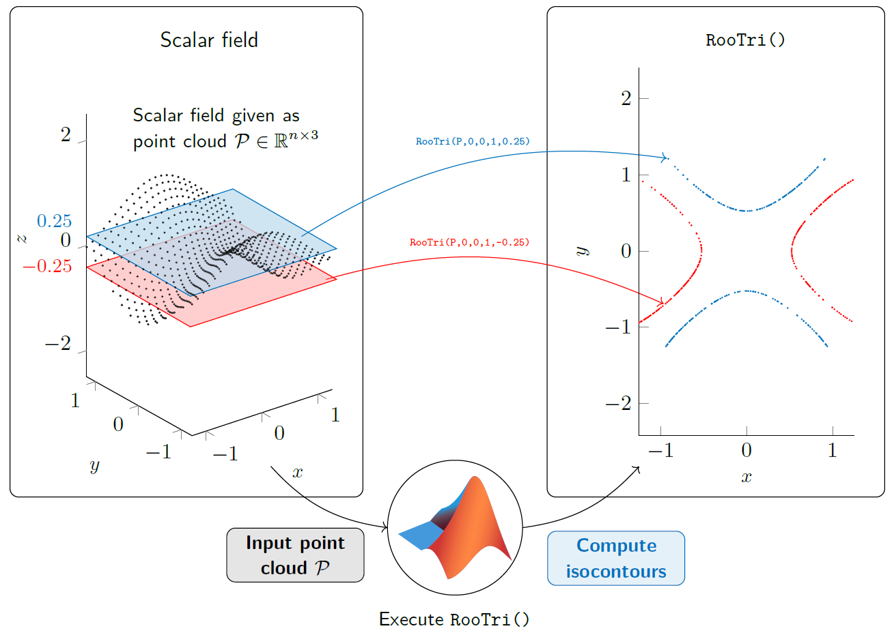

# RooTri
With the function RooTri(), we present a simple and robust calculation method for the approximation of the intersection points of a scalar field given as an unstructured point cloud with a plane oriented arbitrarily in space in MATLAB. 

## Instructions
1. Add RooTri(arg1, arg2, arg3, arg4, arg5) to you current work folder
2. Pass input arguments
   - arg1   point cloud P as n x 3 matrix
   - arg2   a of of parameter plane equation, default = 0    
   - arg3   b of of parameter plane equation, default = 0  
   - arg4   c of of parameter plane equation, default = 1  
   - arg5   d of of parameter plane equation, default = 0
3. Execute script, output m x 2 matrix called 'ipmat'

## Cite as
### BibTeX
~~~markdown
~~~bibtex
@ARTICLE{OELLERICH2023, 
    AUTHOR = {Oellerich, Jan and Büscher, Keno Jann and Degel, Jan Philipp}, 
    TITLE = {RooTri: A Simple and Robust Function to Approximate the Intersection Points of a 3D Scalar Field with an Arbitrarily Oriented Plane in MATLAB}, 
    VOLUME = {16}, 
    ISSN = {1999-4893}, 
    DOI={10.3390/a16090409}, 
    NUMBER = {9}, 
    JOURNAL = {Algorithms}, 
    PUBLISHER = {MDPI AG}, 
    YEAR = {2023}, 
    MONTH = {Aug}, 
    PAGES = {409} 
}
~~~
~~~

### MDPI and ACS Style
Oellerich, J.; Büscher, K.J.; Degel, J.P. RooTri: A Simple and Robust Function to Approximate the Intersection Points of a 3D Scalar Field with an Arbitrarily Oriented Plane in MATLAB. Algorithms 2023, 16, 409. https://doi.org/10.3390/a16090409 

### AMA Style
Oellerich J, Büscher KJ, Degel JP. RooTri: A Simple and Robust Function to Approximate the Intersection Points of a 3D Scalar Field with an Arbitrarily Oriented Plane in MATLAB. Algorithms. 2023; 16(9):409. https://doi.org/10.3390/a16090409 

### Chicago/Turabian Style
Oellerich, Jan, Keno Jann Büscher, and Jan Philipp Degel. 2023. "RooTri: A Simple and Robust Function to Approximate the Intersection Points of a 3D Scalar Field with an Arbitrarily Oriented Plane in MATLAB" Algorithms 16, no. 9: 409. https://doi.org/10.3390/a16090409
